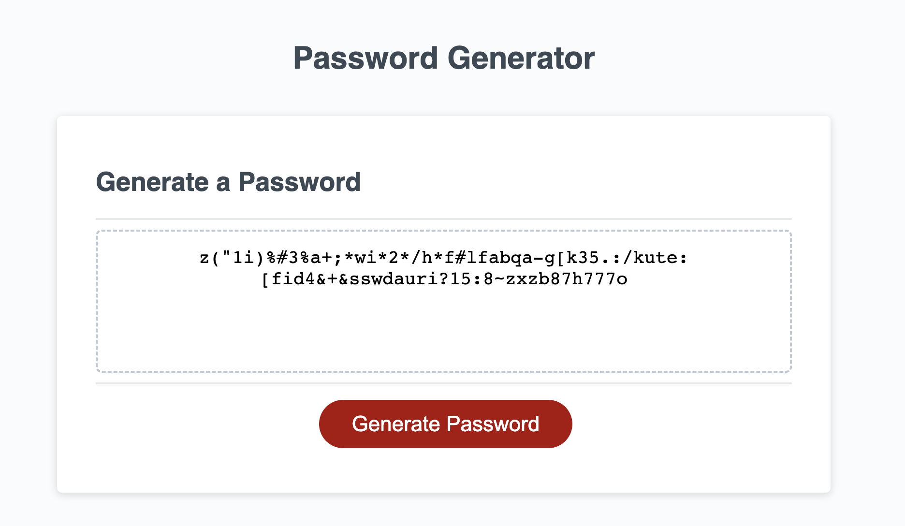
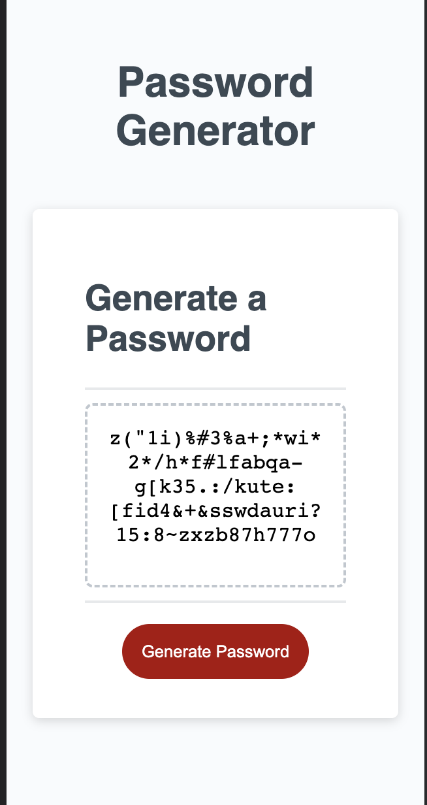

# Password-Provider-5000
Welcome to the Password Generator 5000! My submission for the Password Generator - Module 3 Challenge!
# Challenge 03 - Password-Provider-5000
January 19th, 2023

# Deployment Link

https://melissataylor1.github.io/Password-Provider-5000/

# Description
### Why was this project significant?
This weeks module introduced the FullStack Flex class to JavaScript - the "default language of the internet", the only programming language inside the browser, and the basis of most following modules in this course. This project required students use a broad range of new concepts to implement a unique password generator. The range of concepts required to be implemented included: Functions, Arrays, Math Functions, DOMs, Callbacks, and much more. These practices are what we will build our primary web developoment skills from, so this project was significant as it was most students' first attempt at writing JavaScript from scratch. One important web devleopment fundamental that was excercised during this module was Trouble Shooting, and code refactoring. Through these practices, students not only learn what to look for when troubleshooting their own code, but also how to look for it, and most importantly: through troubleshooting we gain a deeper understand of the language itself. 

### What did this project ask of us? 
The Module 3 Challenge was to build a random password generator. The user clicks a button, and a prompt will display asking to input a numeric password length between 8-128. More prompts follow include if they want to include lower or uppercase letters, special characters, or numbers. The generated password must give an accurate password matching the user's inputted preferences. Additionally, students had to code the generator to respond and adapt to exceptional situations such as: someone inputs a number outside of 8-128 in the length prompt, or someone says no to all the prompts. The CSS and HTML were provided to us beforehand, so students only had to build out the javascript file. 

# Screenshot
Here are various screenshots of my finished site page.
### view of first

### Final view of generated password

### Mobile View

# Liscenses/Credits

The MIT License (MIT)

CSS and HTML were provided to us before hand, I did not create them. 